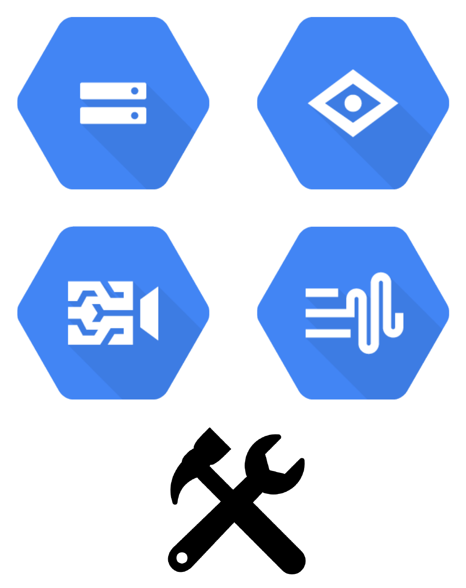

# GCP-ML-API-Demos
Contains Colab Notebooks show cool use-cases of different [GCP ML APIs](https://cloud.google.com/products/ai). The repository accompanies this post - The Maker Philosophy with ML APIs (TODO - Update Link).

</img>

## Acknowledgement
Thanks to the [GDE program](https://developers.google.com/programs/experts/) for providing the GCP credit support which made these demos possible. Thanks to [Karl Weinmeister](https://twitter.com/kweinmeister?lang=en) for reviewing the aforementioned post and for sharing his valuable feedback.

</img>

